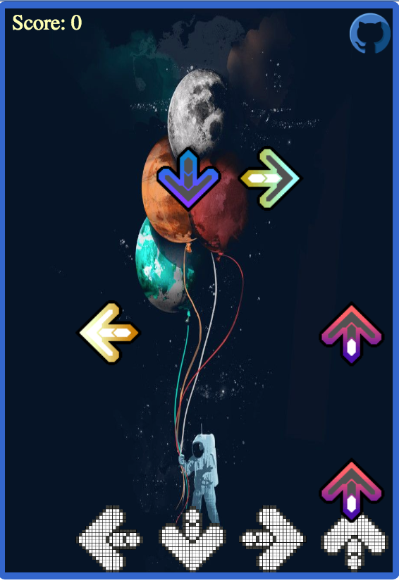

# [Keyboard Hero][link]
[link]: http://phchung.github.io/phchung/Keyboard-Hero


#Instructions

Use QWER to match the floating arrows. The objective is to get as many points as you can.

#Game Design

This game was created with:

- Javascript
- HTML5 Canvas
- Bootstrap
- jQuery

Desinging the timing between the arrows and the song required creating an internal timer when the song has started. Arrows are constantly being added using setInterval with the songTime beingn the input. If the songTime matches with the value in Score.SONG then it gets added. 

```
GameView.prototype.songStarted = function(){
  this.startTime = new Date().getTime()/1000
}

GameView.prototype.run = function(){
  var timer = window.setInterval(function(){
    songTime = new Date().getTime()/1000 - this.startTime
    songTime = Math.round(songTime*10)/10
    this.game.addNotes(songTime)
    if(songTime === 70){
      this.page = 3;
      clearInterval(timer)
      document.getElementById('music').pause()
      document.getElementById('music').currentTime = 0;
    }
  }.bind(this),100)
  frameID = requestAnimationFrame(function(){this.animate()});
}

Score.SONG = [
  [1.8,0],
  [3.1,0],
  [4.4,0],
  [5.8,0],
  [5.8,1],
```



## Future Features

- Using the laws of simliar triangles to create a 3D view of the arrows coming towards the user.
